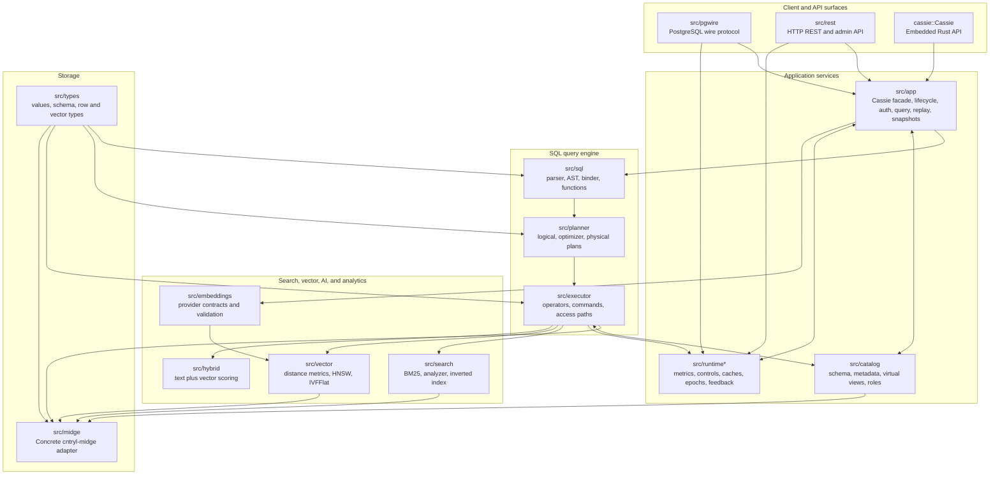
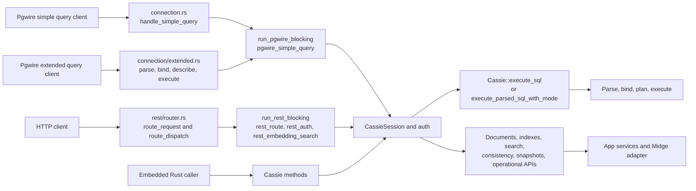
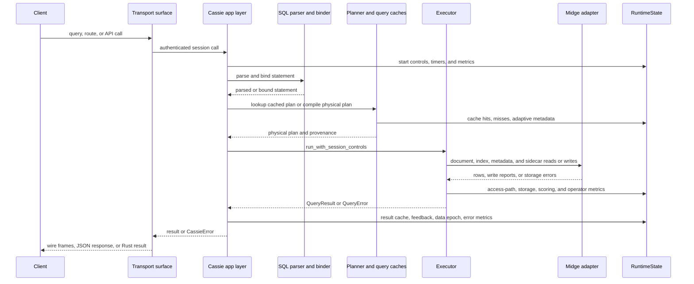
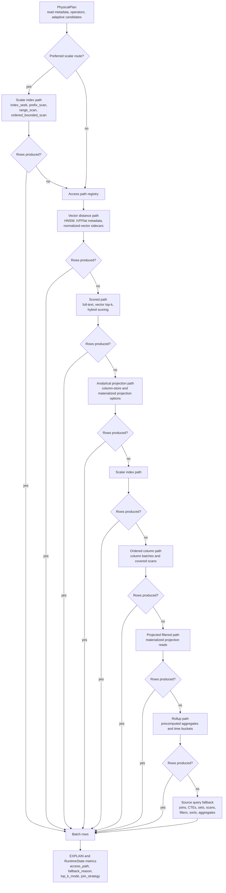
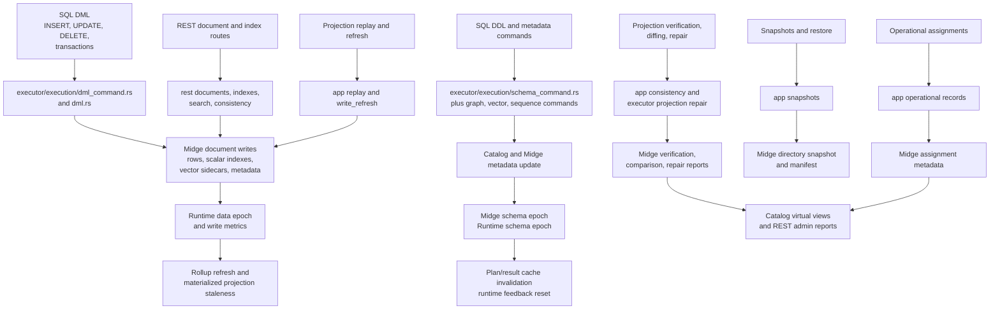
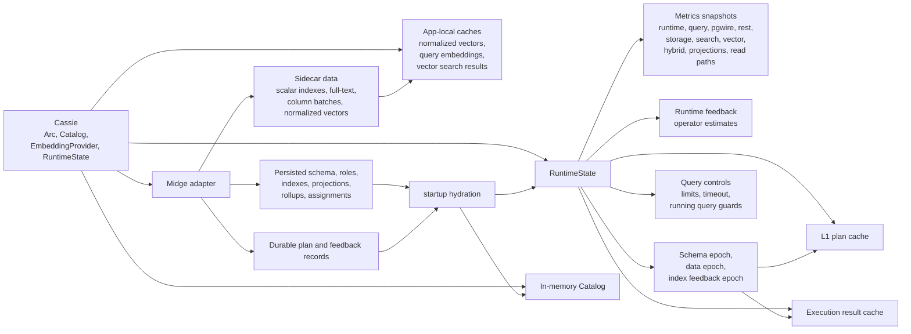

# Architecture Diagrams

This reference documents Cassie's current architecture with Mermaid-in-Markdown diagrams. The diagrams are source-only Markdown so GitHub can render them; no generated PNG or SVG artifacts are checked in.

Use this with [Module Organization](module-organization.md), [Feature Ownership](feature-ownership.md), [Performance Contracts](performance-contracts.md), and [Production Readiness](production-readiness.md). Code links point to the current source of truth for the shape being diagrammed.

## Top-Level Module Ownership

Primary evidence:
[src/lib.rs](../src/lib.rs),
[src/app/mod.rs](../src/app/mod.rs),
[src/executor/mod.rs](../src/executor/mod.rs),
[src/midge/adapter/mod.rs](../src/midge/adapter/mod.rs),
[Feature Ownership](feature-ownership.md), and [Module Organization](module-organization.md).

## Client Entrypoints

Primary evidence:
[src/pgwire/connection.rs](../src/pgwire/connection.rs),
[src/pgwire/connection/extended.rs](../src/pgwire/connection/extended.rs),
[src/pgwire/connection/blocking.rs](../src/pgwire/connection/blocking.rs),
[src/rest/router.rs](../src/rest/router.rs), and
[src/app/query.rs](../src/app/query.rs).

## Query Execution Sequence

Primary evidence:
[src/app/query.rs](../src/app/query.rs),
[src/sql/binder.rs](../src/sql/binder.rs),
[src/planner/physical.rs](../src/planner/physical.rs),
[src/executor/execution/entrypoints.rs](../src/executor/execution/entrypoints.rs), and
[src/runtime.rs](../src/runtime.rs).

## Read Path And Accelerator Selection

The registry order is implemented in [src/executor/execution/dispatch.rs](../src/executor/execution/dispatch.rs). The required access-path vocabulary and diagnostics are documented in [Performance Contracts](performance-contracts.md). Storage-side accelerator modules live under [src/midge/adapter](../src/midge/adapter), with search and vector logic in [src/search](../src/search), [src/vector](../src/vector), and [src/hybrid](../src/hybrid).

## Write And Admin Flows

Primary evidence:
[src/executor/execution/dml_command.rs](../src/executor/execution/dml_command.rs),
[src/executor/execution/dml.rs](../src/executor/execution/dml.rs),
[src/executor/execution/schema_command.rs](../src/executor/execution/schema_command.rs),
[src/app/registry.rs](../src/app/registry.rs),
[src/app/replay.rs](../src/app/replay.rs),
[src/app/consistency.rs](../src/app/consistency.rs),
[src/app/snapshots.rs](../src/app/snapshots.rs),
[src/app/operational.rs](../src/app/operational.rs), and
[Projection Repair Runbook](projection-repair-runbook.md).

## Cross-Cutting State

Primary evidence:
[src/app/state.rs](../src/app/state.rs),
[src/app/lifecycle.rs](../src/app/lifecycle.rs),
[src/app/hydration.rs](../src/app/hydration.rs),
[src/runtime.rs](../src/runtime.rs),
[src/runtime/query_cache.rs](../src/runtime/query_cache.rs), and
[src/midge/adapter/metadata.rs](../src/midge/adapter/metadata.rs).

## Architecture Drift Analysis

These findings are intentionally tied to diagrams and code evidence. They do not change public Rust APIs, SQL behavior, protocol behavior, or storage format.

| Category | Finding | Evidence | Impact | Owner area and follow-up |
| --- | --- | --- | --- | --- |
| Confirmed drift | Several source and test files still exceed the 1,000-line module target. Use the repository audit command in `AGENTS.md` for the current list before planning broad work. | [Module Organization targets](module-organization.md), current source audit | Large files are the clearest current drift from the small-module architecture and make unrelated query, storage, and runtime changes harder to review. | Owners: runtime, midge adapter, executor, catalog, app, and tests. Follow-up: before adding substantial behavior in an oversized file, extract a focused module/test file or record a current split plan. |
| Confirmed drift | `src/app/query.rs` is both a query pipeline coordinator and an owner of plan-cache provenance, result-cache keys, feedback capture, EXPLAIN ANALYZE deltas, timeout checks, and data-epoch mutation. | [Query Execution Sequence](#query-execution-sequence), [src/app/query.rs](../src/app/query.rs), [src/app/cache.rs](../src/app/cache.rs), [src/runtime.rs](../src/runtime.rs) | Query work can accidentally change caching, feedback, epoch, or diagnostics behavior in the same file. | Owner: app/query and runtime. Follow-up: the next broad query-pipeline change should split plan/cache resolution and feedback capture into focused helpers before adding behavior. |
| Candidate risk | Access-path registry order is architecture-significant. New read accelerators can change results or performance if they enter the registry without matching EXPLAIN and metric assertions. | [Read Path And Accelerator Selection](#read-path-and-accelerator-selection), [src/executor/execution/dispatch.rs](../src/executor/execution/dispatch.rs), [Performance Contracts](performance-contracts.md) | Correct row results can hide a degraded Midge access path, especially when fallback scans still pass functional tests. | Owner: planner, executor, runtime metrics. Follow-up: every new access path needs plan assertions, EXPLAIN labels, runtime metrics, and fallback-reason tests in the same slice. |
| Candidate risk | Startup hydration is not purely read-only. It can rebuild normalized vectors for persisted vector indexes and rebuild cardinality stats when stored stats are missing or stale. | [Cross-Cutting State](#cross-cutting-state), [src/app/hydration.rs](../src/app/hydration.rs), [src/midge/adapter/metadata.rs](../src/midge/adapter/metadata.rs), [Production Readiness](production-readiness.md) | Larger vector or high-cardinality deployments may see startup latency and write amplification before the operator has a production-ready guidance surface. | Owner: app hydration, midge metadata, vector. Follow-up: before promoting larger-corpus vector/search readiness, define persisted validity markers, lazy rebuild, or bounded background rebuild behavior. |
| Candidate risk | REST remains secondary/admin, but its route table touches documents, indexes, vector search, consistency reports, and auth. It is compact today, but new admin routes can blur public query and operator workflows. | [Client Entrypoints](#client-entrypoints), [src/rest/router.rs](../src/rest/router.rs), [Feature Ownership](feature-ownership.md), [Production Readiness](production-readiness.md) | REST could grow into a parallel primary interface with weaker compatibility and diagnostics guarantees than pgwire. | Owner: REST and app services. Follow-up: keep REST additions administrative or explicitly document any user-visible overlap with pgwire in [PostgreSQL Compatibility](postgres-compatibility.md) and [Feature Support](feature-support.md). |
| Accepted tradeoff | Pgwire and REST are async transports over a synchronous engine. Blocking work is intentionally isolated behind `spawn_blocking` boundaries. | [Client Entrypoints](#client-entrypoints), [src/pgwire/connection/blocking.rs](../src/pgwire/connection/blocking.rs), [src/rest/router.rs](../src/rest/router.rs), [Runtime-Boundary Contract](performance-contracts.md#runtime-boundary-contract-phase-04) | Engine internals stay simpler, but every transport change must preserve the boundary to avoid blocking Tokio worker tasks. | Owner: pgwire, REST, runtime. Follow-up: new protocol or route work must use the existing blocking helpers and keep transport-boundary tests current. |
| Accepted tradeoff | Midge is the only storage layer. Indexes, projections, search, vector sidecars, snapshots, and metadata use the concrete adapter instead of a backend trait. | [Top-Level Module Ownership](#top-level-module-ownership), [src/midge/adapter/mod.rs](../src/midge/adapter/mod.rs), [src/midge/adapter/key_encoding.rs](../src/midge/adapter/key_encoding.rs), [Module Organization](module-organization.md#midge-adapter) | Storage format and accelerator behavior are tightly coupled to Midge locality, which is intentional for V1 but raises migration cost for persisted key changes. | Owner: midge adapter and catalog. Follow-up: all persisted key work must continue through `key_encoding.rs` and include an explicit migration plan for storage-layout changes. |
| Accepted tradeoff | The diagrams include stable and experimental surfaces. The architecture map is broader than production-ready support, and no feature family is production-ready by default. | [Production Readiness](production-readiness.md), [Product Roadmap](product-roadmap.md), [Experimental Promotion Criteria](experimental-promotion-criteria.md) | Readers must not infer production guarantees from a surface appearing in the architecture diagrams. | Owner: docs and feature owners. Follow-up: when a surface promotes, update readiness, support, compatibility, and this architecture map in the same slice. |

## Maintenance Rules

- Update these diagrams when a module boundary, client entrypoint, storage sidecar, runtime cache, or admin workflow changes.
- Keep Mermaid node IDs stable and labels short enough for GitHub rendering.
- Do not add generated diagram artifacts unless the repository adopts a deterministic Mermaid render step.
- Drift findings should stay evidence-linked and should name a concrete owner and follow-up.
